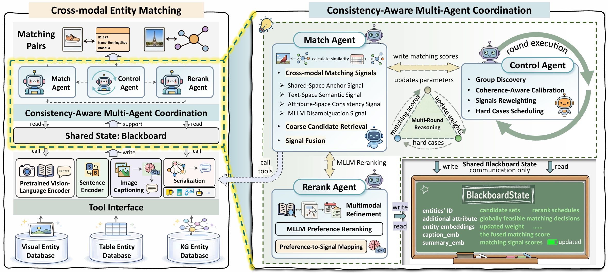
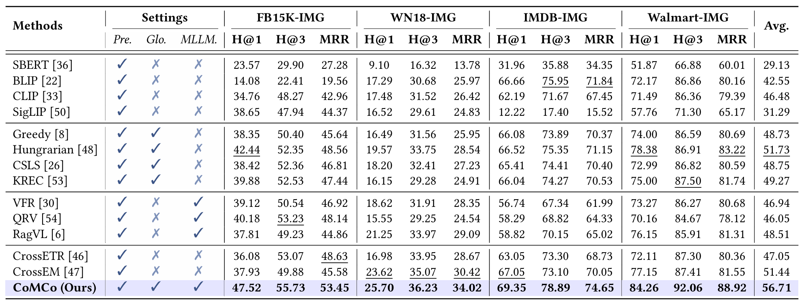

# 🧠 CoMCo: Consistency-Aware Multi-Agent Coordination for Zero-Shot Cross-Modal Entity Matching (SIGIR'26)


>We present CoMCo, a multi-agent framework for zero-shot cross-modal entity matching, where no task-specific training is performed. It separates multiple matching signals construction from global decision making: the Match Agent fuses multiple matching signals beyond a single pretrained similarity score to produce more reliable pairwise evidence under noisy and ambiguous cross-modal data; the Control Agent improves global consistency by identifying latent coherent groups from candidate overlap and competition, calibrating candidate preferences with group-level coherence, mitigating misleading matches caused by the hubness phenomenon, and orchestrating iterative refinement; and the Rerank Agent is triggered only for hard cases, selectively invoking an MLLM to disambiguate confusable candidates.




## 🛠️ Install
```bash
>> cd CoMCo
>> pip install -r requirements.txt
```

> NOTE: CLIP is installed from the official OpenAI repo.

---

## 📚 Dataset
> We evaluate CoMCo on four datasets covering both KG-visual and table-visual matching scenarios. For the KG-visual setting, we use **FB15K-IMG** and **WN18-IMG**, where structured entities are KG nodes characterized by attributes and relation triples, and visual entities are images. For the table-visual setting, we construct two real-world benchmarks based on **IMDB** and **Walmart**, where structured entities are table rows described by multiple attributes and visual entities are web images.

<div align="center">

| Datasets     | Modality      | #Records | #Vertices | #Triplets | #Images |
|--------------|---------------|---------:|----------:|----------:|--------:|
| FB15K-IMG    | KG + Image    |        – |    14,541 |   310,116 | 145,944 |
| WN18-IMG     | KG + Image    |        – |    41,105 |    93,003 |  70,349 |
| IMDB-IMG     | Table + Image |   12,557 |         – |         – |  12,557 |
| Walmart-IMG  | Table + Image |    2,192 |         – |         – |   2,192 |

</div>

>**❗Note:** The links to the existing benchmark datasets we used (FB15K-IMG, WN18-IMG) are [here](https://zenodo.org/records/18427316), and the links to the datasets we constructed ourselves (IMDB-IMG, Walmart-IMG) are [here](https://zenodo.org/records/18418291).
---
## 🧰 Tools

**Serialization Tool**  
Converts a structured entity (either a table row or a KG entity) into a compact textual representation `r_s` that can be consumed by downstream tools. In table datasets, this is typically the entity description (`desc`) only; in KG datasets, it can be a templated Graph2Text serialization of the local neighborhood (e.g., `[ENTITY] ...`, `[RELATION] ... -> ...`). This tool standardizes heterogeneous structured inputs into a consistent text form for anchor encoding and summarization.

**Pretrained Vision-Language Encoder Tool**  
Encodes images and serialized entity texts into a shared embedding space and produces the anchor signal `s_anch(v,s)=cos(x_v,y_s)`. It is used for coarse candidate retrieval (top-K filtering) and as a strong but lightweight evidence source. In our paper, the tool computes CLIP image/text embeddings on demand.

**Image Captioning Tool**  
Generates a concise caption `p_v` for each image using Qwen2.5-VL. The caption provides a text-space view of the visual content that complements the anchor signal, especially in fine-grained or ambiguous cases. Captions are cached and reused across rounds, and are primarily consumed by the semantic matching tool chain (caption → sentence embedding → similarity).

**Summarization Tool**  
Produces a one-sentence abstract `a_s` for each structured entity using Qwen2.5 (prompt-based knowledge distillation). For KG datasets, the input is the serialized neighborhood text (Graph2Text) derived from sampled relations; for table datasets, the input is typically `(name, description)`. The summary is designed to preserve only explicitly given information and is cached as a stable textual surrogate for semantic comparison.

**Sentence Encoder Tool**  
Encodes natural-language strings into sentence embeddings using a lightweight SBERT model. This tool is shared across multiple signal pipelines and is optimized for batched inference.

**Attribute Extraction Tool**  
Extracts compact attribute phrase sets from both modalities to provide an attribute-consistency signal. On the visual side, Qwen2.5-VL extracts `A(v)` (e.g., category cues, color/material/style, salient properties) from the image; on the structured side, Qwen2.5-VL extracts `A(s)` from the entity text (typically `desc` or summary). The resulting phrases are embedded by the sentence encoder and pooled to compute an attribute similarity score that improves robustness when semantic or anchor signals are insufficient.

**MLLM Disambiguation Tool**  
Performs preference-based reranking on hard cases using Qwen2.5-VL. Given an image and a shortlist of candidate entities, the tool outputs a complete `ranking` over the shortlist, which is then deterministically mapped into a continuous disambiguation score `z(v,s)` via inverse-rank scoring. This tool is only invoked for scheduled hard cases, and its outputs are written back to the blackboard as an additional evidence signal that can override or refine earlier rankings.

> All tool outputs are cached through `ToolRegistry` on disk and mirrored into the blackboard state.
> Configure `qwen25vl` and prompt templates in `comco/configs/default.yaml`.

## 🚀 Quick start
```bash
# start the Ollama server
ollama serve

# pull the required models
ollama pull qwen2.5:7b
ollama pull qwen2.5vl:7b
```

```bash
# For IMDB-IMG/Walmart-IMG
python scripts/run_comco.py \
  --dataset_name walmart \
  --dataset_mode table \
  --dataset_root ./data/walmart \
  --image_root ./data/walmart/walmart-images

# For WN18-IMG/FB15K-IMG
python scripts/run_comco.py \
  --dataset_name WN18 \
  --dataset_mode kg \
  --dataset_root ./data/WN18 \
  --image_root ./data/WN18/WN18-images \
  --kg_train ./data/WN18/train.tsv
```

The first run will compute and cache CLIP embeddings under:

- `.cache/comco/<dataset_hash>/<clip_model>/anchor_image/*.npy`
- `.cache/comco/<dataset_hash>/<clip_model>/anchor_text/*.npy`

---

## 🏅 Results


